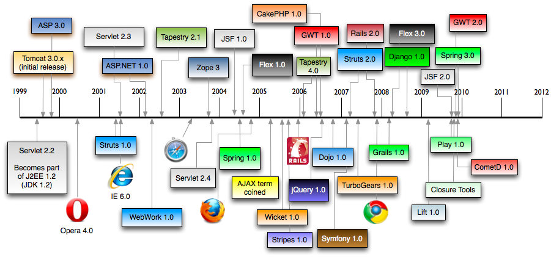
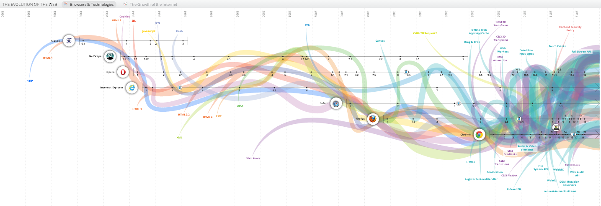
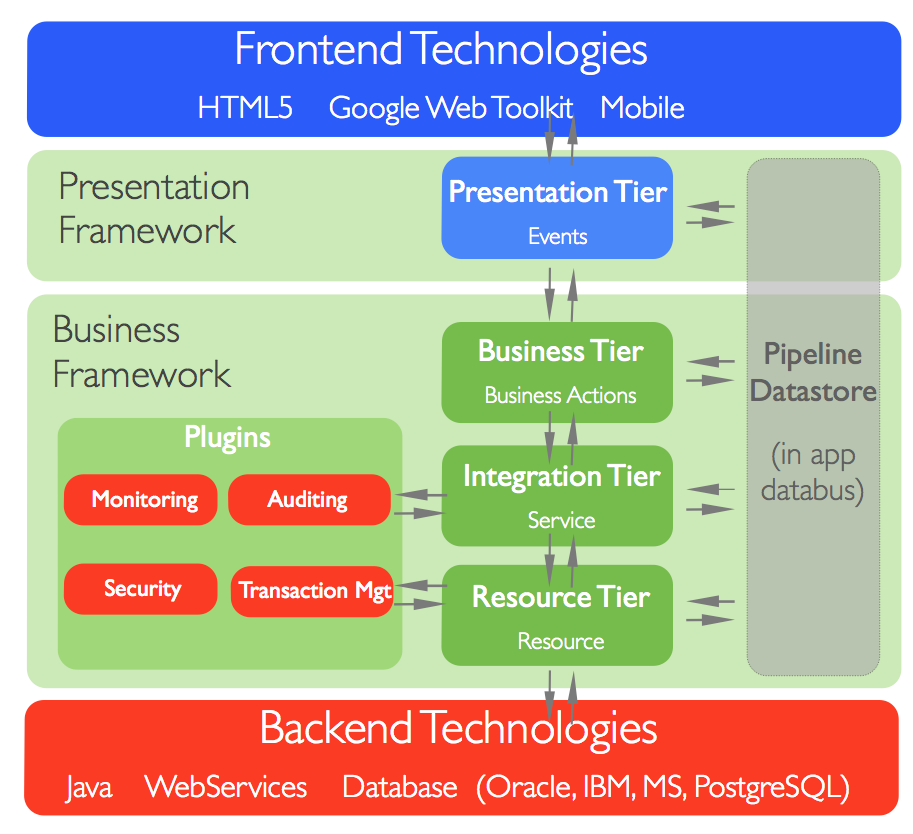
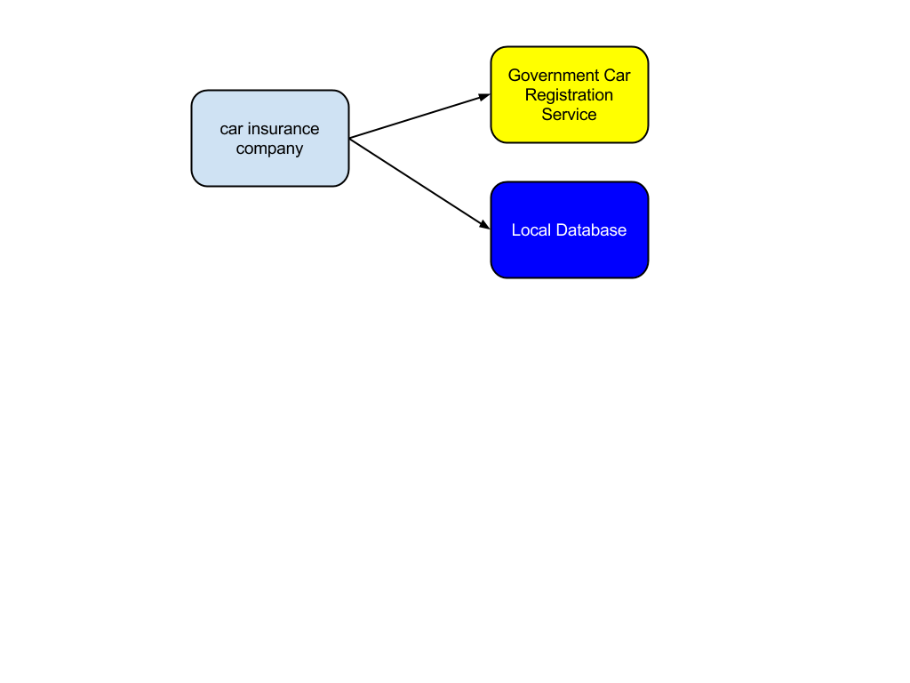
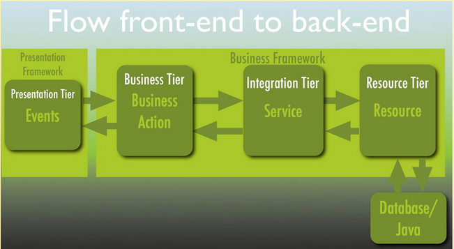
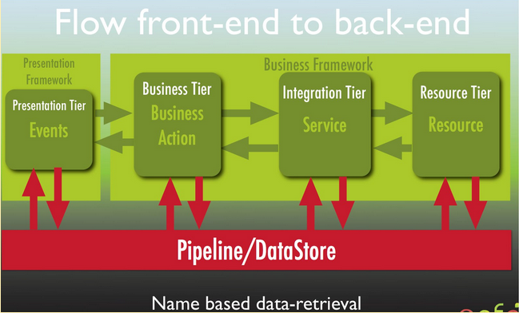

#QAFE Book

## 1. Introduction: QAFE Core Platform

### 1.1 What is QAFE?
QAFE is a product from [Qualogy Solutions B.V](http://www.qualogy.com) and is an acronym for "Quality Application Framework for Enterprises".

QAFE is the result of years of experience, best practices and theory. They all come together in this product. This product is meant for large enterprises and foresees in future developments.

### 1.2 Why QAFE ?
QAFE was born as a result of the fact that application development became harder while technologies evolved.
One major technology which became an industry standard is Oracle Forms. Oracle Forms is implementation of the Client-Server Paradigm, where data entry from desktop clients to a centralized database is the core application.
Since Oracle Forms was a solid solution, worldwide companies implemented their core process in Oracle Forms. Next to being a solid solution, building applications in Oracle Forms technology was fast. Productivity of Oracle Forms Developers was high.

Technology evolved and just around the year 2000 Oracle announced to go the Web and Java. Internet was gaining momentum, even Enteprises started to believe in internet technology. The stack that Oracle was foreseeing for the next generation applications was Java based, which is different than the base for Oracle Forms (which is PL/SQL).
In the same time, somehow to create a simple application was too hard. It took days, and the progress that was made was just not that of what was expected. Furthermore, for some developers the change of mindset from relational/data oriented thinking to object oriented was needed. This was a hard one. Some Oracle Forms Developers made it, but most of them didn't. Still the relational/data oriented developer (currently called "Oracle Classic Developers") had a strong argument against the new object oriented way of development, the productivity being higher than the developer using object orientation.
Furthermore, besides the fact that there was a change of mindset, several other influences were found, that made software development in current days just too cumbersome. On the presentation technologies there were a lot of developments happening at the same time.

(source: http://www.flickr.com/photos/mraible/4378559350/sizes/l/)

Technology never evolved this fast before.

Just around 2004, new architectures and frameworks are known to be Web 2.0 technologies and allow the same behavior that we know from the desktop applications which ruled the world in the beginning of 90's. With traditional web applications (1995-2003) there were several drawbacks. One among them is that we had to make concessions to the way we used to work on the desktop. That wasn't even possible at that time (not without a lot of java scripting or java applets).

A revolution took place in the web which resulted in the evolution of Web2.0 technologies. Google made services that were very easy to use from user experience perspective. Adobe showed some great stuff with its FlashPlayer. Microsoft came with a competing solution, called Silverlight and Sun is trying to do the same with JavaFX.

The web evolved even more: While most technologies from 2005 - 2010 were plugin based or AJAX based, Javascript became the new kid on the  block.

(source: http://www.evolutionoftheweb.com/)

New frameworks came up and evolution of the web was faster than ever.

The main questions for enterprises and developers were: which one to choose from for future direction? What is the learning curve? How futureproof is this technology? Can I reuse my knowledge? What about mobile applications ? How to adapt new technologies ?

Besides the rollercoaster ride on the presentation side, there was another drawback: the adoption of Service Oriented Architecture (SOA), which was found to slow down the process of application development. Nevertheless, SOA is buzzing for years and is here to stay even if it is difficult to apply in existing environments (the new environments can directly benefit from it of course). The main goal of SOA was to have integration with several sources and clean distinction between presentation and logic.

QAFE has been designed to tackle these factors, ultimately benefiting customers and developers to build and use applications easily.

### 1.3  The global architecture
Consider this following situation: The presentation technologies on one side and the back-end technologies on the other side (Note: WS is short for "Web Services", so that means in fact any other technology).

There is a big gap between these two worlds.

In the following overview QAFE is in fact the glue between these two worlds. QAFE consists of two major parts:

- Presentation Framework

- Business Framework

### 1.4 Presentation Framework

The presentation framework is in fact an engine that can translate *technology independent application definition* to a specific presentation technology. We are ''abstracting'' from technology. The technology independent definition is done in QAML, QAFE's Markup Language. QAML is a highly declarative way to define layout. These application definition can stay independent of any technology changes. We do not know what the next best thing is on the field of web development, but we now know that we can easily adapt to those changes.
> A nice example of an application that didn’t change functionality-wise for more than a decade, is Google search. See this link http://blogoscoped.com/archive/2006-04-21-n63.html how the User Interface didn’t change, while the underlying web technology evolved.

The setup of the presentation framework is as follows:
- Windows

- Components

- Styles (for styling with CSS)

- Events

A window is the main container for an application. QAFE's default way of representing this is by a virtual desktop that runs in your browser (there is a mobile version available too).

The DateDemo and QAFE Showcase in this screenshot are QAFE Applications. Your desktop any time, any place, anywhere!

The window has a special sub-element, called rootpanel. A rootpanel is special kind of panel. A panel is a container for components. Buttons, textfields, checkbox, etc are examples of Components. Panel also is a special kind of component. A panel is a container component in which components can be put in certain orientation on the screen (horizontal,vertical, grid, dock,etc). The orientation is referred to as layout.

Bottom-line is that the layout of an application can be drawn with a pen and paper and that same layout can be created with QAML in a declarative way with the advantage that the object orientation is applied on the same.

QAFE has an XSD which defines the possibilities of the declaratives in a QAML file. With an editor that supports auto-complete based on XSD, creating QAFE applications is really easy.

QAFE also has an IDE based on Eclipse called the QAML Builder.

So far, what we mentioned is called declarative UI, which is very popular at this moment because of it's flexibility and simplicity.

Now, to the part that makes QAFE Presentation Framework unique: The interaction with the backend.

The first thing we do, is to define an event declaratively. This in fact means that we are creating an event driven application like we used to do for desktop applications in the 90's (with Delphi, Visual C++).

By abstracting interaction, there is no need to learn another language (like ActionScript for Flex, Javascript for HTML, some other scripting for Silverlight, etc.) for creating web
 applications. By generalizing the events, we can easily render to the specific technology.

The presentation framework consists of several engines that translate the QAML presentation tier to a specific presentation technology. As a start we chose GWT ( Google WebToolkit, an HTML/Javascript solution) and Adobe Flex (a plugin technology, since it is quite popular and due to fact that it was installed on 90% of the computers). That was at the start QAFE in 2007.

Nowadays we focus on modern Javascript (there are many options since this technology is evolving is high pace). That’s why deprecated the Adoble Flex Render Engine. The number of these render engines can (and will) be extended by the QAFE team or by the open source community (QAFE will go open source Q3 2014).

### 1.5 The Business Framework

The business framework of QAFE is a SOA enabled framework, i.e., existing or new services (either written in Java/DB/WebService technology) are able to work together with in a lightweight business processor.

With the following example one might understand the purpose of the business framework:
Consider you want to have a new car insurance: What you need to provide business wise is your ID and license plate number. With the ID, one can find your personal data in the local database of the insurance company. With the license plate number one can invoke the central web service of the "Government Car Registration Government Server" and get the car data. Based on this data, one can calculate a price for the car insurance.

Normally, it would take time to create such a business function (DB statements, WS, control logic, etc. in either J2EE or .NET) as several skill-sets have to be included. Using QAML and QAFE engine for business processing this done in a matter of minutes:

The business framework consists of three layers:
Business Actions

- Services

- Resources

We'll start with the last one: *The Resource Tier*.

A resource is defined as a specific technology endpoint that is provided with a name for QAML. So for example, we have a database connection with a specific URL and connection settings. For this connection we provide a name, say "MyDatabaseConnection". From now on, we connect to the name, instead of the specific connection settings. The same goes for a piece of functionality in a java class. We just specify where to find the class (in which package, providing the fully qualified name) and give it a name, like "MyJavaClass" and use it to acccess the class.

The name is utilized in the *Integration Tier* where the *Services* are defined. Services connect to a resource. Defining an *API* or *service* that has to be used in the application is done this way. The native resources are now *SOA enabled* ! So for each resource we create *service* with methods that we want to use in the rest of the application (read: invoke from the presentation tier).

Now that we have services, we can combine them in a *business action*. In the sample the business action could be: *Find the person in the local database. If successful, find the car data with the license plate number.* This is something that could be translated to an UML Use Case and thus can be interpreted by a business analyst. This forms the most important part of a SOA making the process *Business Oriented*, instead of technical. This is also the difference between a service and a business action: A service is more technical, a business action is more about functional requirements.

In the business action, control flow is allowed (if statements, for loops, etc), so as to implement functional requirements (for example: *if userdata found, continue*). Business actions can be invoked from events.

### 1.6 Put it all together

When we start with on click of a button, we invoke an event, that on its term can invoke a business action. The business action controls the flow to several services. Each of the services are connected to a specific resource which on it's turn is either a SQL statement (in database or intermediate), a Java class or a Webservice.

The data is sent back through the layers until it is back in the event and the event can present the data.

Data-handling is done with the concept that is known in many BPEL engine kind of products: A pipeline/datastore.

The interaction between the layers is seamless and easy: Just refer to a name and QAFE will try to find it. The same goes for business actions, service, resources, events and components.

With QAML and your favorite technology (SQL, Java, etc.) you can create Enterprise Web Applications with current technologies in a future proof declarative way.

In the next chapters will cover how to create applications and how to benefit from these concepts.
